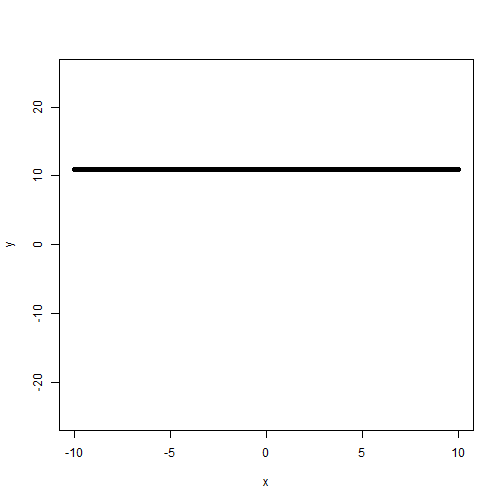
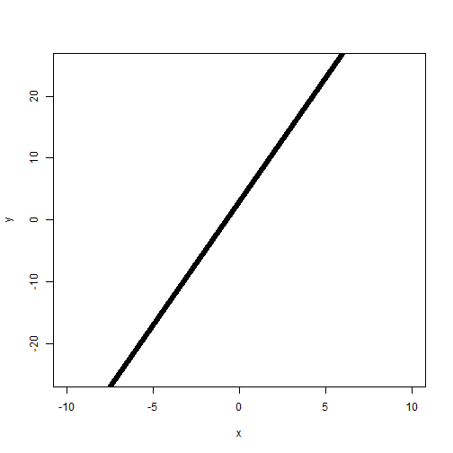
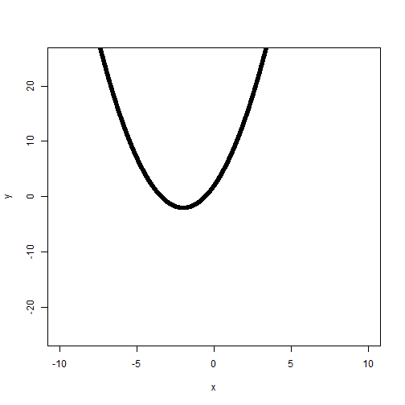
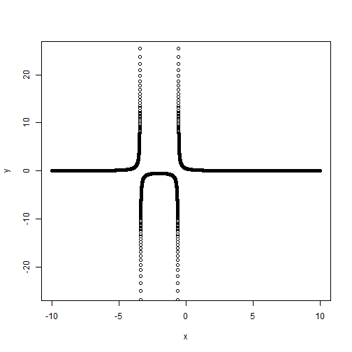

Interacters of y = (a + bx + cx^d)^e
========================================================
author: Christine Hainey
date: 
autosize: true

 Background
========================================================

Part of learning math is to see who each part of an equation interacts.
I've created an interactive app to let kids see in action how changing 
y-inercept, coefficents and exponents change a graph.

Children can move the y-intercept (a) from -10 to 10.  The b & c coefficient varies from -10 to 10, while the expont d varies from -5 to 5.  The base equation has a coeficient also, to look at the inverse of the base equation. 

Hopefully, children will find this interactive app useful. I've included four graphs that the children can try to reproduce and think about the interactions.

  y = (a + bx + cx^d)^e
========================================================
a = 10

b = 0 

c = 1 

d = 0 

e = 1

  y = (a + bx + cx^d)^e
========================================================
a = 2 

b = 4

c = 0

d = 1

e = 1

 y = (a + bx + cx^d)^e
========================================================
a = 2 

b = 4

c = 0

d = 1

e = 1

 y = (a + bx + cx^d)^e
========================================================
a = 2 

b = 4

c = 0

d = 1

e = 1

